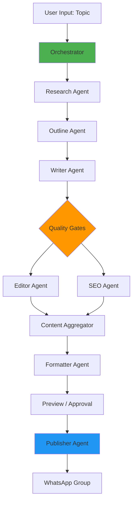

# Agentic Post - Implementation Plan

## Project Overview

**Agentic Post** is an AI orchestration system that automates content creation and publishing. It demonstrates multi-agent coordination, sequential and parallel orchestration patterns, and real-world integration with WhatsApp.

**Core Value:** Learn AI orchestration practically while building a useful automation tool.

---

## User Review Required

> [!IMPORTANT]
> **WhatsApp Integration Method**
> 
> We'll use **WhatsApp Web automation** (via browser automation) for the MVP. This approach:
> - Works immediately without approval
> - Perfect for learning and personal use
> - Can be upgraded to official API later if needed
> 
> **Limitation:** Requires browser to be open during publishing. For production use with high volume, consider upgrading to WhatsApp Business API.

> [!NOTE]
> **LLM Choice**
> 
> The plan assumes **Ollama (local LLM)** for cost-free operation. If you prefer better quality:
> - Use OpenAI GPT-4 for critical agents (Writer, Editor)
> - Cost: ~$0.01-0.05 per article
> 
> Can be easily swapped - the architecture supports both.

---

## System Architecture

### High-Level Flow



### Agent Specialization

| Agent | Role | Input | Output | Week |
|-------|------|-------|--------|------|
| **Orchestrator** | Coordinate workflow | User topic | Agent execution plan | 2 |
| **Research Agent** | Gather information | Topic | Structured research data | 2 |
| **Outline Agent** | Create structure | Research data | Content outline | 2 |
| **Writer Agent** | Generate content | Outline | Full draft article | 2 |
| **Editor Agent** | Improve quality | Draft | Polished content | 3 |
| **SEO Agent** | Optimize for search | Draft | SEO metadata + tips | 3 |
| **Formatter Agent** | Prepare for WhatsApp | Polished content | Message chunks | 3 |
| **Publisher Agent** | Send to WhatsApp | Formatted messages | Publishing status | 4 |

---

## Proposed Changes

### Core Application Structure

```
c:\Silambu\contentflow-ai\
├─ backend\
│  ├─ agents\
│  │  ├─ __init__.py
│  │  ├─ base_agent.py          # Base agent class
│  │  ├─ research_agent.py      # Web research
│  │  ├─ outline_agent.py       # Structure creation
│  │  ├─ writer_agent.py        # Content writing
│  │  ├─ editor_agent.py        # Quality improvement
│  │  ├─ seo_agent.py           # SEO optimization
│  │  ├─ formatter_agent.py     # WhatsApp formatting
│  │  └─ publisher_agent.py     # WhatsApp publishing
│  ├─ orchestrator\
│  │  ├─ __init__.py
│  │  └─ pipeline.py            # Agent coordination logic
│  ├─ utils\
│  │  ├─ llm_client.py          # Ollama/OpenAI wrapper
│  │  ├─ web_search.py          # Search API integration
│  │  └─ whatsapp.py            # WhatsApp automation
│  ├─ main.py                   # FastAPI application
│  └─ requirements.txt
├─ frontend\
│  ├─ index.html                # Main UI
│  ├─ styles.css                # Styling
│  └─ app.js                    # Frontend logic
└─ README.md
```

---

### Week 1: Foundation & Basic Generation

#### [NEW] [backend/agents/base_agent.py](file:///c:/Silambu/contentflow-ai/backend/agents/base_agent.py)

Base class for all agents with common functionality:
- LLM client integration
- Retry logic with exponential backoff
- Logging and error handling
- Standard input/output format

**Key Features:**
- Abstract `execute()` method for agent logic
- Built-in prompt template handling
- Response validation
- Performance tracking

#### [NEW] [backend/agents/writer_agent.py](file:///c:/Silambu/contentflow-ai/backend/agents/writer_agent.py)

Single-agent content generator for MVP:
- Takes topic as input
- Generates complete blog post
- Uses structured prompt for consistency
- Returns markdown-formatted content

**Prompt Engineering:**
- System prompt defines writer persona
- Few-shot examples for quality
- Output format specification

#### [NEW] [backend/utils/llm_client.py](file:///c:/Silambu/contentflow-ai/backend/utils/llm_client.py)

LLM abstraction layer:
- Supports Ollama (local) and OpenAI
- Unified interface for both
- Automatic model selection
- Token counting and cost tracking

#### [NEW] [backend/main.py](file:///c:/Silambu/contentflow-ai/backend/main.py)

FastAPI backend:
- `/api/generate` - Content generation endpoint
- `/api/status` - Job status tracking
- WebSocket for real-time progress
- CORS configuration for frontend

#### [NEW] [frontend/index.html](file:///c:/Silambu/contentflow-ai/frontend/index.html)

Simple, beautiful web interface:
- Topic input form
- Generate button
- Loading indicator
- Markdown content display
- Modern, clean design with gradients

**UI Features:**
- Single-page application
- Real-time content streaming
- Copy to clipboard
- Download as markdown

---

### Week 2: Multi-Agent Orchestration

#### [NEW] [backend/agents/research_agent.py](file:///c:/Silambu/contentflow-ai/backend/agents/research_agent.py)

Web research capabilities:
- Integration with DuckDuckGo Search API (free)
- Extracts relevant information from top results
- Summarizes findings
- Returns structured research data

**Output Format:**
```json
{
  "topic": "...",
  "key_points": [...],
  "sources": [...],
  "statistics": [...]
}
```

#### [NEW] [backend/agents/outline_agent.py](file:///c:/Silambu/contentflow-ai/backend/agents/outline_agent.py)

Content structure creator:
- Takes research data as input
- Generates logical content outline
- Suggests sections and subsections
- Estimates word count per section

**Output Format:**
```json
{
  "title": "...",
  "sections": [
    {
      "heading": "...",
      "key_points": [...],
      "word_count": 300
    }
  ]
}
```

#### [MODIFY] [backend/agents/writer_agent.py](file:///c:/Silambu/contentflow-ai/backend/agents/writer_agent.py)

Enhanced to use outline:
- Now takes outline as input (not just topic)
- Writes section by section
- Maintains consistency across sections
- References research data

#### [NEW] [backend/orchestrator/pipeline.py](file:///c:/Silambu/contentflow-ai/backend/orchestrator/pipeline.py)

Sequential orchestrator:
- Coordinates agent execution order
- Passes data between agents
- Handles errors gracefully
- Tracks overall progress
- Implements retry logic

**Orchestration Pattern:**
```python
async def run_pipeline(topic):
    # Sequential execution
    research = await research_agent.execute(topic)
    outline = await outline_agent.execute(research)
    content = await writer_agent.execute(outline, research)
    return content
```

#### [MODIFY] [backend/main.py](file:///c:/Silambu/contentflow-ai/backend/main.py)

Updated to use orchestrator:
- Replace single agent with pipeline
- Add progress tracking per agent
- WebSocket updates for each stage
- Better error responses

#### [MODIFY] [frontend/index.html](file:///c:/Silambu/contentflow-ai/frontend/index.html)

Enhanced UI:
- Pipeline visualization (progress bars per agent)
- Step-by-step status updates
- Show intermediate outputs (research, outline)
- Collapsible sections for each stage

---

### Week 3: Quality Enhancement & Parallel Processing

#### [NEW] [backend/agents/editor_agent.py](file:///c:/Silambu/contentflow-ai/backend/agents/editor_agent.py)

Content review and improvement:
- Grammar and spelling fixes
- Readability enhancement
- Tone consistency
- Fact-checking suggestions
- Improvement notes

**Prompt Focus:** Act as professional editor

#### [NEW] [backend/agents/seo_agent.py](file:///c:/Silambu/contentflow-ai/backend/agents/seo_agent.py)

SEO optimization:
- Keyword extraction and analysis
- Meta description generation
- SEO-friendly title suggestions
- Internal linking recommendations
- Readability score

**Output:**
```json
{
  "keywords": [...],
  "meta_description": "...",
  "title_suggestions": [...],
  "seo_score": 85
}
```

#### [NEW] [backend/agents/formatter_agent.py](file:///c:/Silambu/contentflow-ai/backend/agents/formatter_agent.py)

WhatsApp message formatter:
- Splits content into chunks (< 4096 chars)
- Adds strategic emojis
- Applies WhatsApp markdown (*bold*, _italic_)
- Creates engaging hooks
- Adds call-to-action

**Output Format:**
```json
{
  "messages": [
    "🎯 *10 Python Tips for Beginners*\n\n...",
    "📌 *Tip 1: Use List Comprehensions*\n...",
    "✅ *Ready to level up?* Try these today!"
  ]
}
```

#### [MODIFY] [backend/orchestrator/pipeline.py](file:///c:/Silambu/contentflow-ai/backend/orchestrator/pipeline.py)

Add parallel execution:
- Run Editor + SEO agents simultaneously
- Aggregate results
- Continue to Formatter

**Updated Pattern:**
```python
async def run_pipeline(topic):
    # Sequential
    research = await research_agent.execute(topic)
    outline = await outline_agent.execute(research)
    draft = await writer_agent.execute(outline, research)
    
    # Parallel execution
    editor_task = editor_agent.execute(draft)
    seo_task = seo_agent.execute(draft)
    edited_content, seo_data = await asyncio.gather(editor_task, seo_task)
    
    # Continue
    formatted = await formatter_agent.execute(edited_content)
    return formatted, seo_data
```

#### [MODIFY] [frontend/index.html](file:///c:/Silambu/contentflow-ai/frontend/index.html)

Visual enhancements:
- Parallel agent indicators (show both running)
- SEO score display
- WhatsApp message preview
- Emoji picker for customization

---

### Week 4: WhatsApp Publishing & Production Polish

#### [NEW] [backend/agents/publisher_agent.py](file:///c:/Silambu/contentflow-ai/backend/agents/publisher_agent.py)

WhatsApp publishing via browser automation:
- Selenium-based WhatsApp Web control
- QR code login (one-time)
- Group selection
- Message sending with delays
- Image upload support
- Status verification

**Key Methods:**
- `login()` - Authenticate with WhatsApp Web
- `select_group(name)` - Navigate to group
- `send_messages(messages)` - Send message sequence
- `upload_image(path, caption)` - Send images

#### [NEW] [backend/utils/whatsapp.py](file:///c:/Silambu/contentflow-ai/backend/utils/whatsapp.py)

WhatsApp Web automation utilities:
- Browser session management
- Element selectors for WhatsApp UI
- Retry logic for UI interactions
- Screenshot capabilities
- Error detection

**Selenium Setup:**
- Chrome/Edge WebDriver
- Headless mode option
- Session persistence

#### [MODIFY] [backend/orchestrator/pipeline.py](file:///c:/Silambu/contentflow-ai/backend/orchestrator/pipeline.py)

Add publishing step:
- Optional human approval gate
- Schedule for later option
- Publish immediately option
- Publishing status tracking

#### [NEW] [backend/database.py](file:///c:/Silambu/contentflow-ai/backend/database.py)

SQLite database for content history:
- Store generated content
- Track publishing status
- User preferences
- WhatsApp group configurations

**Tables:**
- `content` - Generated articles
- `publish_history` - Publishing logs
- `groups` - WhatsApp group settings
- `preferences` - User settings

#### [MODIFY] [frontend/index.html](file:///c:/Silambu/contentflow-ai/frontend/index.html)

Production UI with stunning design:
- Modern gradient backgrounds
- Smooth animations
- WhatsApp preview (exact look)
- Group selector dropdown
- Publish/Schedule buttons
- Content history sidebar
- Edit before publish mode
- Export options (PDF, MD, HTML)

**Design Features:**
- Glassmorphism effects
- Responsive mobile layout
- Dark mode support
- Real-time pipeline animation
- Success celebrations (confetti!)

#### [NEW] [README.md](file:///c:/Silambu/contentflow-ai/README.md)

Comprehensive documentation:
- Project overview
- Setup instructions
- Architecture explanation
- Agent descriptions
- Usage guide
- Screenshots/demo
- Troubleshooting

---

## Technology Stack

### Backend
- **Python 3.10+**
- **FastAPI** - Modern web framework
- **Ollama** - Local LLM (llama3 or mistral)
- **Selenium** - Browser automation
- **SQLite** - Local database
- **asyncio** - Async orchestration

### Frontend
- **HTML5/CSS3/JavaScript** - Clean, no framework bloat
- **Marked.js** - Markdown rendering
- **WebSocket** - Real-time updates

### AI & APIs
- **Ollama API** - Local LLM inference
- **DuckDuckGo Search API** - Free web search
- **OpenAI API** (optional) - Better quality LLM

### Tools
- **Chrome/Edge WebDriver** - WhatsApp automation
- **Git** - Version control

---

## Verification Plan

### Automated Tests

**Week 1 Tests:**
```bash
# Test basic content generation
python -m pytest tests/test_writer_agent.py

# Verify LLM client works
python -m pytest tests/test_llm_client.py
```

**Week 2 Tests:**
```bash
# Test agent orchestration
python -m pytest tests/test_pipeline.py

# Verify data passing between agents
python -m pytest tests/test_agent_integration.py
```

**Week 3 Tests:**
```bash
# Test parallel execution
python -m pytest tests/test_parallel_agents.py

# Verify formatter output
python -m pytest tests/test_formatter_agent.py
```

**Week 4 Tests:**
```bash
# Test WhatsApp automation (without sending)
python -m pytest tests/test_publisher_agent.py

# End-to-end pipeline test
python -m pytest tests/test_e2e.py
```

### Manual Verification

**Week 1:**
- Generate content for 3 different topics
- Verify quality and formatting
- Check UI responsiveness

**Week 2:**
- Run full pipeline (research → outline → write)
- Verify each agent's output quality
- Check orchestration timing

**Week 3:**
- Test parallel agent execution
- Verify formatted WhatsApp messages look good
- Check SEO suggestions are relevant

**Week 4:**
- **Manual WhatsApp test** (send to test group)
- Verify messages appear correctly
- Test scheduled publishing
- Full demo run: topic → published on WhatsApp

### Success Metrics

✅ **Functional:**
- Content generation completes in < 2 minutes
- All agents execute successfully
- WhatsApp publishing works reliably
- No crashes or errors in normal flow

✅ **Quality:**
- Generated content is coherent and useful
- SEO suggestions are relevant
- WhatsApp formatting looks professional
- UI is intuitive and beautiful

✅ **Learning:**
- Understanding of sequential orchestration
- Understanding of parallel execution
- Practical experience with LLMs
- Real-world automation skills

---

## Risk Mitigation

| Risk | Mitigation |
|------|------------|
| **Ollama quality issues** | Provide OpenAI switch, detailed prompts |
| **WhatsApp Web changes** | Use stable selectors, screenshot on error |
| **Rate limiting** | Add delays, queue system |
| **Web search API limits** | Cache results, fallback to manual research |
| **Browser automation fails** | Headless mode toggle, detailed logging |

---

## Future Enhancements

After the 1-month MVP, consider:

- **Multi-platform publishing** (Telegram, Discord, Slack)
- **Content calendar** with auto-scheduling
- **Analytics tracking** (engagement metrics)
- **A/B testing** different content versions
- **Voice input** for topic selection
- **Image generation** for article thumbnails
- **Translation agent** for multi-language content
- **Fact-checking agent** for accuracy
- **Sentiment analysis** for tone optimization

---

## Cost Analysis

**Free Tier (Recommended for Learning):**
- Ollama: FREE (local)
- DuckDuckGo Search: FREE
- Selenium: FREE
- SQLite: FREE
- FastAPI: FREE
- **Total: $0/month**

**Paid Tier (Better Quality):**
- OpenAI GPT-4: ~$0.03/article
- 100 articles/month: ~$3/month
- Everything else: FREE
- **Total: ~$3-5/month**

---

## Timeline Summary

| Week | Milestone | Agent Count | Key Learning |
|------|-----------|-------------|--------------|
| 1 | Working MVP | 1 | LLM integration, basic UI |
| 2 | Multi-agent pipeline | 4 | Sequential orchestration, agent coordination |
| 3 | Quality enhancement | 7 | Parallel execution, formatting |
| 4 | Production ready | 8 | Publishing, automation, polish |

---

## Next Steps After Approval

1. **Setup workspace** - Create project structure
2. **Install dependencies** - Python packages, Ollama
3. **Week 1 implementation** - Basic content generator
4. **Iterative development** - Build week by week
5. **Testing & refinement** - Ensure quality
6. **Demo & showcase** - Final presentation

---

**Ready to build Agentic Post!** 🚀
